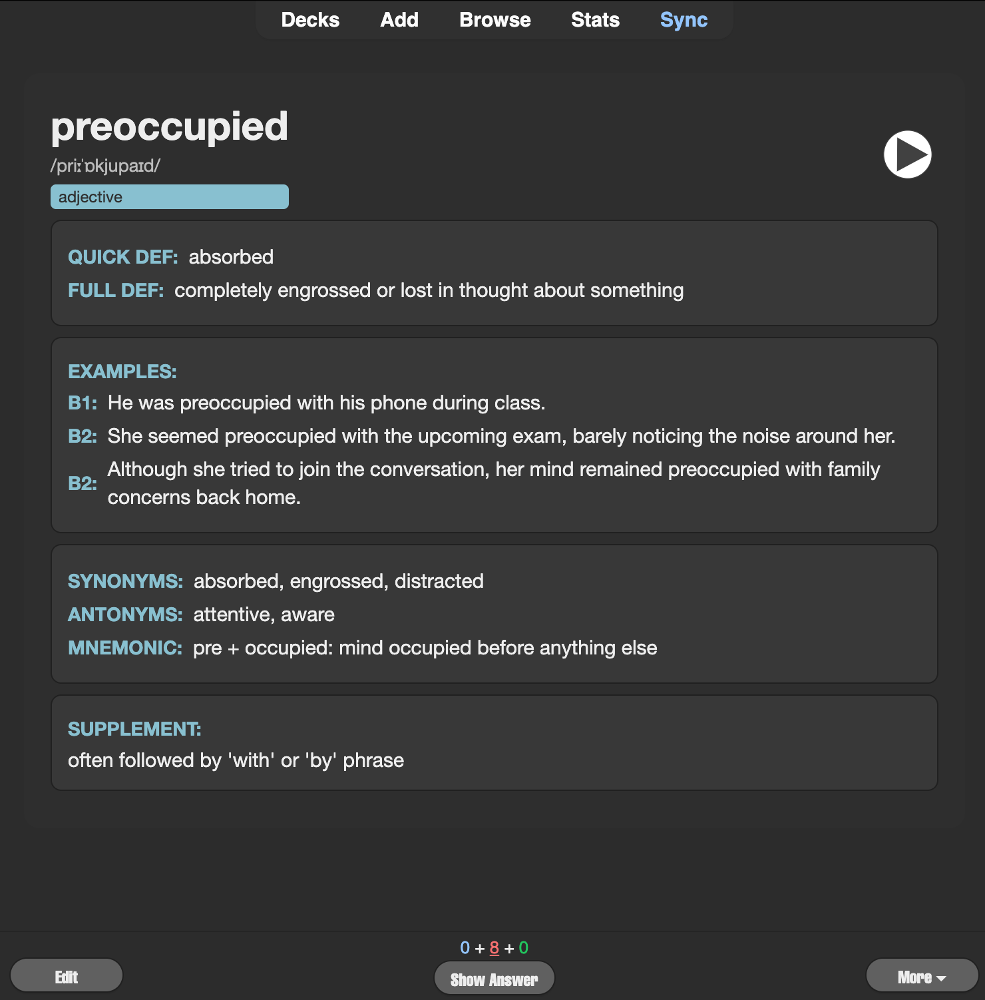
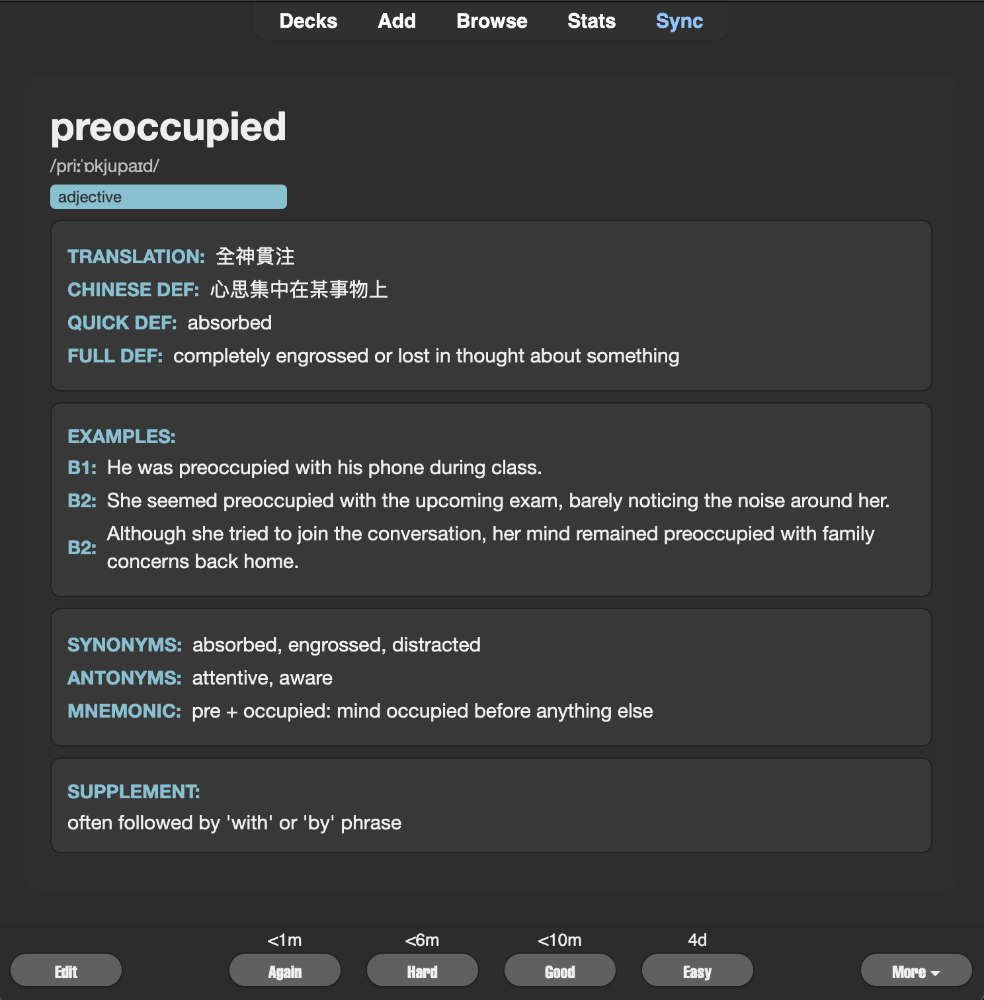

# 🎯 AI-Powered Anki Cards for English Vocabulary Learning

**Transform your English vocabulary learning with AI-generated Anki cards!** This project helps you create beautiful, comprehensive vocabulary cards in minutes instead of hours.

## 📚 Table of Contents

- [🎯 AI-Powered Anki Cards for English Vocabulary Learning](#-ai-powered-anki-cards-for-english-vocabulary-learning)
  - [📚 Table of Contents](#-table-of-contents)
  - [🚀 Quick Start (30 seconds)](#-quick-start-30-seconds)
  - [📋 What You Need Before Starting](#-what-you-need-before-starting)
  - [🎁 What You'll Get](#-what-youll-get)
  - [👀 See Your Cards in Action](#-see-your-cards-in-action)
    - [Front of Card (What you see when studying)](#front-of-card-what-you-see-when-studying)
    - [Back of Card (The answer with all the details)](#back-of-card-the-answer-with-all-the-details)
  - [📚 Complete Step-by-Step Tutorial](#-complete-step-by-step-tutorial)
    - [Step 1: Prepare Your Word List](#step-1-prepare-your-word-list)
    - [Step 2: Generate Cards with AI](#step-2-generate-cards-with-ai)
    - [Step 3: Download Your CSV File](#step-3-download-your-csv-file)
    - [Step 4: Import into Anki (Detailed Instructions Below)](#step-4-import-into-anki-detailed-instructions-below)
  - [🗂️ Understanding Your Card Fields](#️-understanding-your-card-fields)
  - [🤖 AI Prompt - Copy \& Paste This!](#-ai-prompt---copy--paste-this)
    - [📝 Example: How to Use the Prompt](#-example-how-to-use-the-prompt)
  - [🎨 Card Templates (The Beautiful Part!)](#-card-templates-the-beautiful-part)
  - [📥 Setting Up Anki (Step-by-Step)](#-setting-up-anki-step-by-step)
    - [Part 1: Create a New Note Type](#part-1-create-a-new-note-type)
    - [Part 2: Apply Our Beautiful Templates](#part-2-apply-our-beautiful-templates)
    - [Part 3: Import Your CSV](#part-3-import-your-csv)
  - [🆘 Troubleshooting \& FAQ](#-troubleshooting--faq)
    - [Common Issues](#common-issues)
    - [FAQ](#faq)
  - [🤝 Contributing](#-contributing)

## 🚀 Quick Start (30 seconds)

1. **Make a word list** → Write English words you want to learn (one per line)
2. **Use AI** → Copy our prompt to ChatGPT/Claude with your word list  
3. **Download CSV** → AI generates a file with definitions, examples, and more
4. **Import to Anki** → Use our templates for beautiful cards
5. **Start learning!** → Study with rich, comprehensive vocabulary cards

## 📋 What You Need Before Starting

- **Anki installed** on your device ([Download here](https://apps.ankiweb.net/))
- **Access to AI** (ChatGPT, Claude, or similar)
- **5-10 minutes** for initial setup

## 🎁 What You'll Get

✅ **Rich vocabulary cards** with definitions, examples, synonyms, and more
✅ **Beautiful design** with dark theme and clear typography  
✅ **Consistent format** for all your vocabulary cards  
✅ **Multiple difficulty levels** (B1 and B2 example sentences)  
✅ **Memory aids** including mnemonics and native language translations  
✅ **Audio pronunciation** support built-in

## 👀 See Your Cards in Action

Here's exactly what your vocabulary cards will look like:

| **Front of Card** (What you see when studying) | **Back of Card** (The answer with all the details) |
|:-----------------------------------------------:|:---------------------------------------------------:|
|  |  |

**Pretty impressive, right?** Your cards will have a professional dark theme with all the vocabulary information beautifully organized!

## 📚 Complete Step-by-Step Tutorial

### Step 1: Prepare Your Word List

Create a simple text file with English words or phrases you want to learn. Put each word on a separate line:

**Example word list:**
```
serendipity
to procrastinate
natural language processing
comprehensive
resilience
```

### Step 2: Generate Cards with AI

Copy the AI prompt below and paste it into ChatGPT, Claude, or your preferred AI tool. Then paste your word list and hit enter!

### Step 3: Download Your CSV File

The AI will create a CSV file with all the vocabulary information. Download it to your computer.

### Step 4: Import into Anki (Detailed Instructions Below)

Import the CSV file into Anki and apply our beautiful card templates.

## 🗂️ Understanding Your Card Fields

Your vocabulary cards will be packed with useful information! Here's what each field contains:

| Field | What It Contains | Example |
|-------|------------------|---------|
| **Word** | The vocabulary you're learning | "serendipity" |
| **Pronunciation** | How to say it (phonetic guide) | "/ˌserənˈdipədē/" |
| **Part of Speech** | Grammar type | "noun" |
| **Quick Definition** | Short, memorable meaning | "pleasant surprise" |
| **Full Definition** | Complete explanation | "The occurrence of events by chance in a happy way" |
| **B1 Example** | Simple sentence | "Finding that book was pure serendipity." |
| **B2 Example 1** | More complex sentence | "The serendipitous discovery changed her career path." |
| **B2 Example 2** | Another usage example | "Their meeting was a serendipitous moment that led to lifelong friendship." |
| **Synonyms** | Similar words | "chance, luck, fortune" |
| **Antonyms** | Opposite words | "misfortune, bad luck" |
| **Memory Aid** | Trick to remember | "Serene + dip = peaceful discovery" |
| **Translation** | Your native language | "意外收获" (Chinese example) |
| **Native Explanation** | Explanation in your language | "指意外发现好事物" |
| **Extra Notes** | Additional info | "Often used in academic contexts" |

## 🤖 AI Prompt - Copy & Paste This!

**Simply copy the text below and paste it into ChatGPT, Claude, or any AI assistant:**

> **💡 Pro Tip:** This works best with ChatGPT (GPT-4), Claude, or similar AI models. Results may vary with different AI tools.

``` prompt
You are a **CSV Generator**. When I provide you with multiple English words or phrases—each on its own line—output:

1. A downloadable CSV file named `output.csv` (using python_user_visible) containing one row per input, with columns in this exact order:

Word,Pronunciation,PartOfSpeech,QuickDef,FullDef,B1Example,B2Example1,B2Example2,Synonyms,Antonyms,Mnemonic,ChTrans,ChDef,Supplement

2. Also display the raw CSV text in a fenced code block for quick preview.

**Field Definitions:**
- **Word**  
The target vocabulary item (single word or multi-word phrase).

- **Pronunciation**  
Phonetic transcription (e.g. IPA: `/kəmˈprɛhənsɪv/`) or any romanization.  
_Leave blank for multi-word phrases._

- **PartOfSpeech**  
The grammatical category (noun, verb, adjective, adverb).

- **QuickDef**  
A super-concise gloss or phrase that captures the core meaning (for lightning-fast recall).

- **FullDef**  
A fuller, sentence-style definition in English providing nuance and context.

- **B1Example**  
A simple (CEFR B1) example sentence—short and straightforward.

- **B2Example1**  
A middle-length (CEFR B2) example sentence using a somewhat complex structure.

- **B2Example2**  
A second CEFR B2 sentence showing a different usage or collocation (longer).

- **Synonyms**  
Comma-separated list of words with the same or very similar meaning (spaces after commas).

- **Antonyms**  
Comma-separated list of words with opposite meanings (spaces after commas).

- **Mnemonic**  
A memory aid (image suggestion, pun, phrase, or short story).

- **ChTrans**  
Your native‐language translation of the word (e.g. 中文：全面的).

- **ChDef**  
A brief explanation in your native language, clarifying usage.

- **Supplement**  
Additional notes (e.g., alternate part of speech, secondary meaning, usage tips).

---

**Example Input:**

serendipity
to procrastinate
natural language processing

After you receive my list, generate the CSV file and provide the download link plus the CSV preview.
```

### 📝 Example: How to Use the Prompt

1. Copy the prompt above
2. Paste it into your AI assistant
3. Then add your word list like this:

```
serendipity
to procrastinate
natural language processing
comprehensive
resilience
```

4. The AI will generate a CSV file and show a preview
5. Download the file and import it into Anki!

## 🎨 Card Templates (The Beautiful Part!)

The `template/` folder contains everything you need for gorgeous cards:

- **`front-template.html`** — What you see when studying (the question side)
- **`back-template.html`** — The answer side with translations and extra info  
- **`style.css`** — Beautiful dark theme styling

**👀 Want to see how they look?** Scroll up to the [See Your Cards in Action](#-see-your-cards-in-action) section for actual card examples!

## 📥 Setting Up Anki (Step-by-Step)

### Part 1: Create a New Note Type

1. **Open Anki** and click **"Tools"** → **"Manage Note Types"**
2. **Click "Add"** → **"Clone: Basic"** 
3. **Name it** "AI Vocabulary Cards" (or whatever you like)
4. **Click "Fields..."** and add these fields in order:
   - Word, Pronunciation, PartOfSpeech, QuickDef, FullDef
   - B1Example, B2Example1, B2Example2, Synonyms, Antonyms  
   - Mnemonic, ChTrans, ChDef, Supplement

### Part 2: Apply Our Beautiful Templates  

1. **Click "Cards..."** in the Note Type manager
2. **Copy our front template** from `template/front-template.html` and paste it in the "Front Template" box
3. **Copy our back template** from `template/back-template.html` and paste it in the "Back Template" box  
4. **Copy our CSS** from `template/style.css` and paste it in the "Styling" box
5. **Click "Save"**

### Part 3: Import Your CSV

1. **File** → **"Import"** in Anki
2. **Select your downloaded CSV file**
3. **Choose your "AI Vocabulary Cards" note type**
4. **Map the columns** (Anki usually does this automatically)
5. **Click "Import"**

🎉 **Done!** Your beautiful vocabulary cards are ready to study!

## 🆘 Troubleshooting & FAQ

### Common Issues

**Q: The AI didn't generate a CSV file**  
A: Make sure you copied the entire prompt. Some AIs need you to explicitly ask for the download link.

**Q: My cards look plain/ugly**  
A: Double-check that you copied the CSS from `style.css` into Anki's "Styling" section.

**Q: Some fields are empty**  
A: This is normal! Not every word has antonyms or multiple examples. Empty fields won't show on your cards.

**Q: I want to change the colors/design**  
A: Edit the `style.css` file! The colors are defined at the top with variables like `--accent` and `--bg-card`.

### FAQ

**Can I use this for other languages?**  
Yes! Just modify the AI prompt to generate cards for your target language.

**Do I need to pay for AI access?**  
Most AI tools have free tiers that work great for this. ChatGPT's free version works fine.

**How many words can I process at once?**  
Start with 10-20 words. Very long lists might overwhelm the AI or hit token limits.

**Can I customize the fields?**  
Absolutely! Modify both the AI prompt and the Anki templates to match your learning style.

## 🤝 Contributing

**We welcome contributions!** This project can be expanded in many exciting ways:

### 🎨 Template Contributions
- **New card designs** - Different color themes, layouts, or styling approaches
- **Subject-specific templates** - Cards optimized for grammar, idioms, business vocabulary, etc.
- **Language variations** - Templates adapted for learning other languages

### 🧠 AI Prompt Improvements  
- **Specialized prompts** - For technical vocabulary, academic terms, or specific domains
- **Multi-language prompts** - Generate cards for learning languages other than English
- **Enhanced field generation** - Better examples, mnemonics, or cultural context

### 📚 Additional Card Types
- **Grammar cards** - For learning sentence patterns and grammar rules
- **Listening comprehension** - Templates that work with audio files
- **Image-based cards** - Visual vocabulary with picture associations

### 🛠️ How to Contribute
1. **Fork this repository**
2. **Create your feature branch** (`git checkout -b feature/amazing-template`)
3. **Add your templates** in a new folder (e.g., `template/business-vocabulary/`)
4. **Update documentation** with usage instructions
5. **Submit a pull request** with a clear description

**Questions or ideas?** Open an issue to discuss your contribution ideas!

---

🚀 **Happy learning!** You now have a powerful system to create professional vocabulary cards in minutes instead of hours!