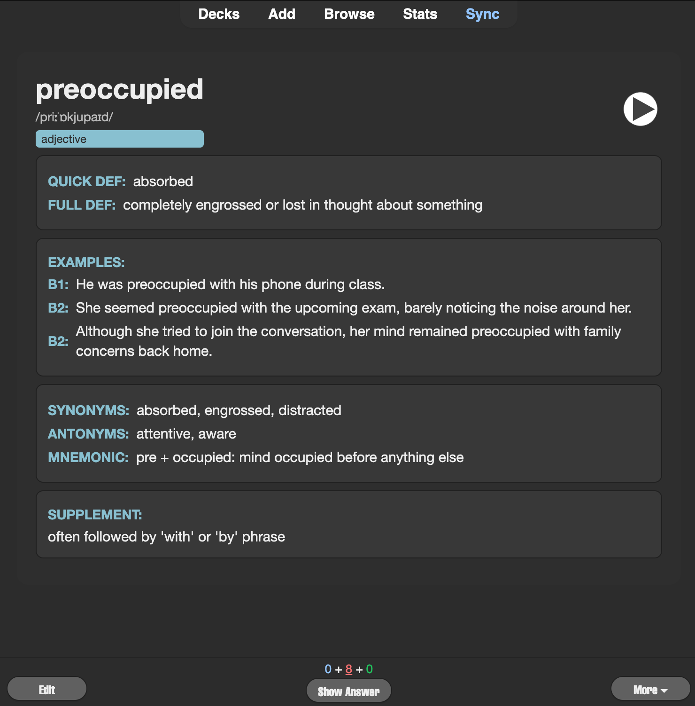
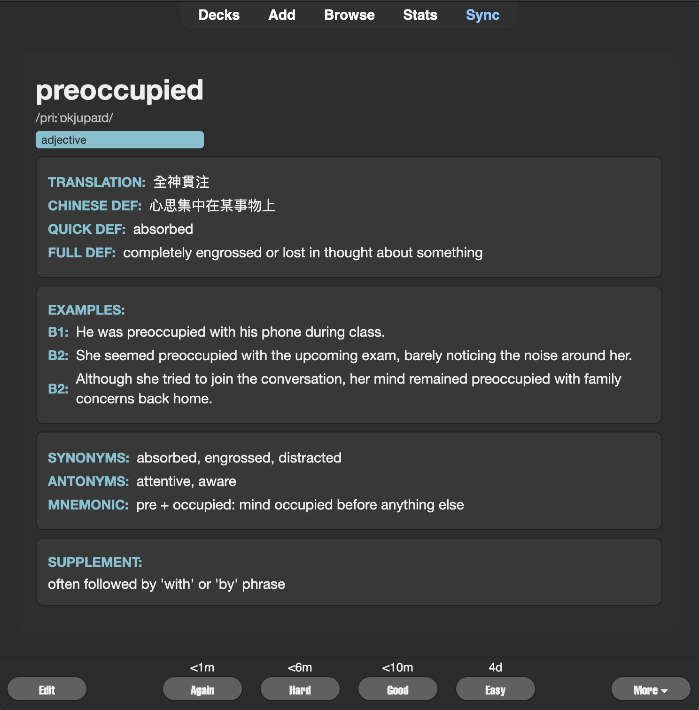

# English → Traditional Chinese Vocabulary Template

🎯 **AI-powered vocabulary cards for learning English with Traditional Chinese translations**

> **語言:** English | [繁體中文](#繁體中文說明)

## What You'll Get

✅ **Rich vocabulary cards** with English definitions and Traditional Chinese translations  
✅ **Beautiful dark theme** with clear typography optimized for studying  
✅ **Multiple example sentences** at B1 and B2 difficulty levels  
✅ **Memory aids** including mnemonics and synonyms/antonyms  
✅ **Audio pronunciation** support built-in  
✅ **Traditional Chinese explanations** for better comprehension

## Card Preview

| **Front (Question)** | **Back (Answer)** |
|:-------------------:|:-----------------:|
|  |  |

## Quick Setup

### 1. Generate Your Vocabulary Data

Use the [AI prompt](prompt.md) to generate CSV data for your word list.

### 2. Create Anki Note Type

1. **Open Anki** → **Tools** → **Manage Note Types**
2. **Add** → **Clone: Basic** → Name it "English-Traditional Chinese"
3. **Fields...** → Add these fields in order:
   - Word, Pronunciation, PartOfSpeech, QuickDef, FullDef
   - B1Example, B2Example1, B2Example2, Synonyms, Antonyms
   - Mnemonic, ChTrans, ChDef, Supplement

### 3. Apply Templates

1. **Cards...** in Note Type manager
2. **Front Template:** Copy content from [`front.html`](front.html)
3. **Back Template:** Copy content from [`back.html`](back.html)
4. **Styling:** Copy content from [`style.css`](style.css)
5. **Save**

### 4. Import Your Data

1. **File** → **Import** in Anki
2. Select your CSV file
3. Choose "English-Traditional Chinese" note type
4. Map columns correctly
5. **Import**

## Field Reference

| Field | English Description | 中文說明 |
|-------|-------------------|---------|
| **Word** | Target vocabulary | 學習的單字或片語 |
| **Pronunciation** | IPA or phonetic guide | 音標或發音指南 |
| **PartOfSpeech** | Grammar category | 詞性（名詞、動詞等） |
| **QuickDef** | Brief definition | 簡短定義 |
| **FullDef** | Complete explanation | 完整英文解釋 |
| **B1Example** | Simple example sentence | 簡單例句 |
| **B2Example1** | Complex example sentence | 複雜例句1 |
| **B2Example2** | Another usage example | 複雜例句2 |
| **Synonyms** | Similar words | 同義詞 |
| **Antonyms** | Opposite words | 反義詞 |
| **Mnemonic** | Memory aid | 記憶技巧 |
| **ChTrans** | Traditional Chinese translation | 繁體中文翻譯 |
| **ChDef** | Chinese explanation | 中文解釋 |
| **Supplement** | Additional notes | 補充說明 |

## Customization

### Color Themes

Edit `style.css` CSS variables to change colors:

```css
:root {
  --bg-card:    #2e2e2e;  /* Card background */
  --bg-box:     #383838;  /* Box background */
  --text-main:  #eeeeee;  /* Main text color */
  --text-muted: #bbb;     /* Secondary text */
  --accent:     #88c0d0;  /* Accent color */
  --border:     #555;     /* Border color */
}
```

### Field Display

Modify the HTML templates to show/hide specific fields or change layouts.

---

## 繁體中文說明

🎯 **使用 AI 技術製作英文詞彙卡片，搭配繁體中文翻譯**

## 功能特色

✅ **豐富的詞彙卡片** 包含英文定義和繁體中文翻譯  
✅ **美觀的深色主題** 清晰的字體設計，最適合學習使用  
✅ **多樣例句** 提供 B1 和 B2 難度等級的例句  
✅ **記憶輔助** 包含記憶技巧、同義詞和反義詞  
✅ **內建語音發音** 支援音訊播放功能  
✅ **繁體中文說明** 幫助更好理解和學習

## 卡片預覽

| **正面（問題）** | **背面（答案）** |
|:-------------------:|:-----------------:|
|  |  |

## 詳細設置步驟

### 1. 生成詞彙數據

使用 [AI 提示檔案](prompt.md) 來為您的單字清單生成 CSV 資料。

### 2. 建立 Anki 筆記類型

1. **開啟 Anki** → **工具** → **管理筆記類型**
2. **新增** → **複製：基礎** → 命名為「英文-繁體中文」
3. **欄位...** → 依序新增以下欄位：
   - Word, Pronunciation, PartOfSpeech, QuickDef, FullDef
   - B1Example, B2Example1, B2Example2, Synonyms, Antonyms
   - Mnemonic, ChTrans, ChDef, Supplement

### 3. 套用模板

1. 在筆記類型管理器中點選 **卡片...**
2. **正面模板：** 複製 [`front.html`](front.html) 的內容
3. **背面模板：** 複製 [`back.html`](back.html) 的內容
4. **樣式：** 複製 [`style.css`](style.css) 的內容
5. **儲存**

### 4. 匯入資料

1. 在 Anki 中選擇 **檔案** → **匯入**
2. 選擇您的 CSV 檔案
3. 選擇「英文-繁體中文」筆記類型
4. 正確對應欄位
5. **匯入**

## 詳細欄位說明

此模板專為學習英文的繁體中文使用者設計，每個欄位的詳細說明如上表所示。

## 自訂設定

### 顏色主題

編輯 `style.css` 中的 CSS 變數來更改顏色：

```css
:root {
  --bg-card:    #2e2e2e;  /* 卡片背景色 */
  --bg-box:     #383838;  /* 內容框背景色 */
  --text-main:  #eeeeee;  /* 主要文字顏色 */
  --text-muted: #bbb;     /* 次要文字顏色 */
  --accent:     #88c0d0;  /* 強調色 */
  --border:     #555;     /* 邊框顏色 */
}
```

### 欄位顯示

修改 HTML 模板來顯示/隱藏特定欄位或更改版面配置。

### 疑難排解

如果卡片顯示不正確：
1. 確認已正確複製所有模板檔案
2. 檢查欄位順序是否與 CSV 檔案一致
3. 確認已套用 CSS 樣式
4. 驗證 Anki 筆記類型中的欄位名稱與模板一致

---

**需要幫助？** 請查看主要的 [README.md](../../README.md) 或建立 Issue。